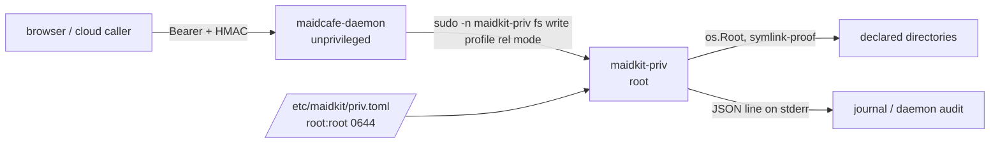

# Privileged operations

MaidCafe's daemon runs as an unprivileged account. Editing an nginx or Caddy
configuration, writing a systemd unit or removing a file under `/etc` needs
root, and the daemon must be able to do those things on behalf of a client that
may be a browser with no SSH session at all.

This document describes how that elevation works, why it is shaped the way it
is, and what it deliberately refuses to do.

## Why not a stored password or an SSH key

The obvious designs are the dangerous ones. Each of these was considered and
rejected:

| Shape | Why not |
| --- | --- |
| Root password in `config.toml` | The file is `0640 root:maidcafe`: the daemon's own account can read it. One read primitive — a bad action, a log alert, the file API — turns into root, which is a strictly larger grant than the write it was meant to enable. |
| `sudo -S` with a stored password | The password travels browser → cloud relay (which terminates TLS and can read it) → daemon → sudo. The relay is designed to be able to read a terminal session; it must never be in a position to capture root. Non-interactive `sudo` also breaks silently under `Defaults use_pty`, two-factor PAM or an expired password. |
| Root SSH private key on disk | The same exposure with more moving parts: `PermitRootLogin prohibit-password`, a pinned host key for the loopback connection, and a second audit trail that does not correlate with the API caller. |
| A wildcard sudoers rule over a general tool | `sudo tee` is root: it writes any path. `sudo systemctl` is root: it loads any unit file, and a unit file's `ExecStart` runs as root. `sudo apt-get install` is root: package maintainer scripts run as root. A rule over a *command* is not a boundary, because the danger is in the *argument*. |

The remaining design is the one this repository implements: **one small
helper, a fixed set of operations, and a root-owned profile file that names the
directories**. The sudoers rule then only ever has to authorize that helper.

## The three pieces



1. **`maidkit-priv`** — a small root-capable binary
   (`cmd/maidkit-priv`, logic in `internal/privfs`). It takes a *profile name*,
   never a directory, and performs one of three operations inside it.
2. **`/etc/maidkit/priv.toml`** — the profile file, owned by root and writable
   only by root. It maps a profile name to a directory and to the modes that
   may be used there. This file, not the sudoers rule, is the authorization
   boundary.
3. **The sudoers rule** — one line per mutating verb, printed by
   `maidkit-priv sudoers`:

   ```sudoers
   maidcafe ALL=(root) NOPASSWD: /usr/local/libexec/maidkit-priv fs write *
   maidcafe ALL=(root) NOPASSWD: /usr/local/libexec/maidkit-priv fs mkdir *
   maidcafe ALL=(root) NOPASSWD: /usr/local/libexec/maidkit-priv fs remove *
   ```

   The trailing wildcard is safe precisely because the helper re-validates
   everything: a caller who appends `--root /` is refused for an unknown
   option, a caller who names an undeclared profile is refused for an unknown
   profile, and a caller who names a path outside the profile is refused by the
   helper's own confinement.

## The helper's command surface

```sh
# content on stdin
maidkit-priv fs write  <profile> <relative-path> <mode>
maidkit-priv fs mkdir  <profile> <relative-path> <mode>
maidkit-priv fs remove <profile> <relative-path>

maidkit-priv fs profiles          # list the configured profiles
maidkit-priv sudoers [account]    # print the rule to install
```

Argument parsing is positional and exact. An unknown option, a duplicated
`--config`, a missing operand or an appended extra argument is a refusal — never
a reinterpretation — so the sudoers wildcard cannot be widened by adding
arguments.

Exit codes distinguish a policy answer from a failure:

| Code | Meaning |
| --- | --- |
| `0` | Done. |
| `2` | Malformed invocation. |
| `3` | Refused by policy (unknown profile, path outside it, mode not granted). |
| `4` | I/O failure. |
| `5` | Not run as root — the sudoers rule is missing. |
| `6` | The profile file is unusable or untrusted. |

## The profile file

```toml
[[profiles]]
name = "nginx"
path = "/etc/nginx"
modes = ["0644", "0640"]

[[profiles]]
name = "systemd-units"
path = "/etc/systemd/system"
modes = ["0644"]
```

Every entry is validated before any operation runs:

- The file must be a **regular file, not a symlink**, **not group- or
  other-writable**, and (for privileged operations) **owned by root**. A file
  the daemon account could rewrite would be a privilege grant it can edit.
- `path` must be absolute and must resolve to an existing directory. Symlinks
  in the path are resolved **once at load**, so swapping a path component later
  cannot move a validated profile somewhere else.
- `modes` may only contain `0600`, `0640`, `0644`, `0700`, `0750`, `0755`.
  Setuid, setgid and sticky are excluded because the helper creates files that
  root may execute; group- and other-write are excluded so a privileged write
  can never plant a file another account can rewrite.
- Names must be unique and match `[a-z0-9][a-z0-9_-]*`.

## Confinement

Two independent layers, exactly like the unprivileged file API:

- **The profile** decides which directory a call may touch. A path that is not
  inside it never reaches the filesystem.
- **`os.Root`** confines the actual I/O. A symbolic link planted inside a
  profile directory cannot redirect a read or a write outside it, which closes
  the race between checking a path and using it. Writes land through a
  temporary file created `O_EXCL` with an unpredictable name and are renamed
  into place, so a reader never sees a half-written configuration and a
  pre-planted temp file is a refusal.

`fs remove` unlinks single files only. Removing a directory tree is not
something a profile authorizes.

## Enabling it for the daemon

The daemon reaches the helper when a file-API root is declared privileged:

```toml
[daemon.files]
enabled = true
allowWrite = true
# privileges are per root, not global
[[daemon.files.roots]]
path = "/srv/app"          # the daemon account can write here: no helper

[[daemon.files.roots]]
path = "/etc/nginx"        # only root can: go through the helper
privileged = true
profile = "nginx"          # must exist in /etc/maidkit/priv.toml
```

`profile` is explicit rather than derived from the path, so the daemon's
allowlist and the helper's allowlist are joined by an operator's decision
instead of by a naming coincidence. A privileged root must also be listed in
the helper's profile file: two operators' decisions, two files, one grant.

Details worth knowing:

- **Reads are never privileged.** The daemon account must be able to read a
  directory for the API to serve it, privileged or not. `/etc/nginx` is
  world-readable by default; a directory that is not becomes unlistable rather
  than silently elevated.
- **`daemon.files.allowWrite = false` still gates privileged roots.** The
  read-only switch is checked before the helper runs, so a privileged root
  cannot be a way around it.
- **A configured root itself is never writable, movable or deletable**, exactly
  as for an unprivileged root.
- **`move` and `copy` are not supported inside a privileged root** and answer
  `501`. Renaming inside a root-owned directory needs root as much as writing
  there does, the helper implements neither verb, and attempting them
  unprivileged would be a partial copy at best. Write the new path and delete
  the old one; both are implemented.
- **The write mode** is the existing file's mode when the daemon can read it
  (matching the truncate-in-place semantics of every other write in the API)
  and `0644` for a new file. A mode the profile does not grant is a refusal
  from the helper, never a silent downgrade, so the operator sees exactly which
  profile to widen.

## The systemd sandbox

Worth knowing before enabling a privileged root: `maidkit-priv` is a child
process of the daemon, so it runs inside the unit's mount namespace.
`ProtectSystem=full` (the shipped unit) makes `/etc` read-only for the helper
exactly as it does for the daemon, so a privileged root under `/etc` needs that
path added to `ReadWritePaths`, and sudo needs its setuid bit, which means
`NoNewPrivileges=false` — the same relaxation that run-as actions already
require.

That relaxation is namespace-wide: the daemon's own process can then write the
path too. In that configuration the helper's guarantee is *authorization* rather
than containment — a client can only reach the path through the validated,
profiled, audited helper — but the daemon process itself is no longer blocked
from it. Options, in order of preference:

1. Put privileged roots on paths the unit does not need to sandbox, so no
   relaxation is required.
2. Accept the relaxation and treat the daemon account as able to write that
   path; the helper still keeps the API's own surface narrow and every call
   audited.
3. Give the helper its own systemd unit outside the daemon's namespace, so the
   daemon keeps its sandbox and still reaches root through a broker. This is the
   design that restores full containment, and it is deliberately not part of
   this feature.

## Installation

```sh
# 1. The helper, root-owned and not writable by the daemon account.
sudo install -d -o root -g root -m 0755 /usr/local/libexec /etc/maidkit
sudo install -o root -g root -m 0755 maidkit-priv /usr/local/libexec/maidkit-priv

# 2. The profiles. This is the file that decides what the helper can reach.
sudo install -o root -g root -m 0644 config.priv.example.toml /etc/maidkit/priv.toml
sudo -e /etc/maidkit/priv.toml
maidkit-priv fs profiles        # parses the file and lists what it grants

# 3. The sudoers rule. `sudoers` prints it, so the rule and the helper cannot
#    drift apart.
sudo install -o root -g root -m 0440 /dev/stdin /etc/sudoers.d/maidkit-priv \
  < <(maidkit-priv sudoers maidcafe)
sudo visudo -c
```

Order matters: install the profiles and the sudoers rule **before** declaring a
privileged root in the daemon configuration, because the daemon validates that
the helper exists at config load.

## Auditing

The helper writes one JSON line to stderr per attempt, successful or refused.
The daemon captures it, journals it, and records its own audit entry:

```json
{"time":"2026-08-15T12:00:00Z","event":"privfs","verb":"write","profile":"nginx",
 "path":"sites-enabled/app.conf","mode":"0644","bytes":512,
 "sha256":"…","ok":true,"euid":0,"invoker":"maidcafe","invoker_uid":"998"}
```

The identity fields come from **sudo's own environment** (`SUDO_USER`,
`SUDO_UID`), not from the command line, so they name the account that actually
invoked the helper rather than one a caller could claim. The daemon's own audit
entry (`daemon.auditPath`) carries the same operation with `privileged: true`
and, for a cloud-relayed call, the `invoked_by` identity the cloud forwarded.

The two records correlate on the path and the content digest: the daemon's entry
says *which client* asked for a change, the helper's says *that root performed
it*. Neither alone answers an incident question; together they do.

## What this deliberately does not do

- **No arbitrary root command.** There is no "run as root" verb. A client that
  needs an arbitrary privileged command uses SSH or the terminal, where the
  operator's own policy governs it.
- **No `chmod`, `chown` or ownership changes.** Changing the owner of a file
  root can write is a way to hand it to another account.
- **No recursive delete, no archive extraction.** Both are ways to make a small
  grant act on an unbounded set of paths.
- **No systemd, package or firewall operations yet.** They are the natural next
  verbs, and the same shape applies: a declared operation, validated arguments,
  never a binary or a unit-file path from the caller. `sudo systemctl start
  nginx.service` is a grant; `sudo systemctl start /tmp/evil.service` is root
  code execution, and the difference must live in the helper, not in the
  sudoers pattern.

## Testing

`internal/privfs` tests cover the parser, the mode and profile rules, the
escape attempts (`..`, absolute paths, a symlink pointing out of the profile),
the content cap and the exit codes. `internal/daemon/files_priv_test.go` drives
the daemon's routing against a stand-in helper that reproduces the real argv
and exit-code contract, including the two failures operators actually hit: a
missing sudoers rule (`403`, naming the rule to install) and the helper not
being granted root.

The genuinely privileged path — a real `sudo -n`, a root-owned profile file and
root-owned targets — cannot be exercised by an unprivileged test run: the helper
refuses to load a profile file this test user owns, and the daemon reaches for
sudo, which has no rule to match. What *can* be checked without root is checked
above; the rest is verified by the end-to-end run that exercises the real
daemon and the real helper over a temporary tree with a stand-in for sudo, and
by installing the helper and confirming `maidkit-priv fs profiles` reports the
grants before a privileged root is enabled.
