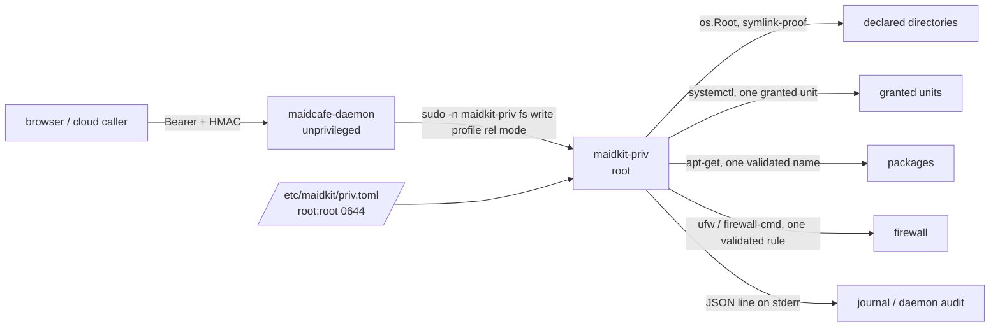

# Privileged operations

MaidCafe's daemon runs as an unprivileged account. Editing an nginx or Caddy
configuration, writing a systemd unit or removing a file under `/etc` needs
root, and the daemon must be able to do those things on behalf of a client that
may be a browser with no SSH session at all.

This document describes how that elevation works, why it is shaped the way it
is, and what it deliberately refuses to do.

## Why not a stored password or an SSH key

The obvious designs are the dangerous ones. Each of these was considered and
rejected:

| Shape | Why not |
| --- | --- |
| Root password in `config.toml` | The file is `0640 root:maidcafe`: the daemon's own account can read it. One read primitive — a bad action, a log alert, the file API — turns into root, which is a strictly larger grant than the write it was meant to enable. |
| `sudo -S` with a stored password | The password travels browser → cloud relay (which terminates TLS and can read it) → daemon → sudo. The relay is designed to be able to read a terminal session; it must never be in a position to capture root. Non-interactive `sudo` also breaks silently under `Defaults use_pty`, two-factor PAM or an expired password. |
| Root SSH private key on disk | The same exposure with more moving parts: `PermitRootLogin prohibit-password`, a pinned host key for the loopback connection, and a second audit trail that does not correlate with the API caller. |
| A wildcard sudoers rule over a general tool | `sudo tee` is root: it writes any path. `sudo systemctl` is root: it loads any unit file, and a unit file's `ExecStart` runs as root. `sudo apt-get install` is root: package maintainer scripts run as root. A rule over a *command* is not a boundary, because the danger is in the *argument*. |

The remaining design is the one this repository implements: **one small
helper, a fixed set of operations, and a root-owned profile file that names the
directories**. The sudoers rule then only ever has to authorize that helper.

## The three pieces



1. **`maidkit-priv`** — a small root-capable binary
   (`cmd/maidkit-priv`, logic in `internal/privfs`). It performs a fixed set of
   operations in four families — files, systemd units, packages and firewall
   rules — and none of them takes a path, a binary or a flag from its caller: a
   file operation names a *profile* it resolves against its own file, a systemd
   operation names a *unit* an operator granted, a package operation names a
   *package* in the manager the grant declared, and a firewall operation names a
   *rule* built from three validated fields.
2. **`/etc/maidkit/priv.toml`** — the grant file, owned by root and writable
   only by root. It maps a profile name to a directory and to the modes that
   may be used there, lists the systemd units and verbs, declares the package
   manager and its verbs, and declares the firewall backend and its verbs. This
   file, not the sudoers rule, is the authorization boundary.
3. **The sudoers rule** — one line per command, printed by
   `maidkit-priv sudoers`:

   ```sudoers
   maidcafe ALL=(root) NOPASSWD: /usr/local/libexec/maidkit-priv fs write *
   maidcafe ALL=(root) NOPASSWD: /usr/local/libexec/maidkit-priv fs mkdir *
   maidcafe ALL=(root) NOPASSWD: /usr/local/libexec/maidkit-priv fs remove *
   maidcafe ALL=(root) NOPASSWD: /usr/local/libexec/maidkit-priv systemd *
   maidcafe ALL=(root) NOPASSWD: /usr/local/libexec/maidkit-priv packages *
   maidcafe ALL=(root) NOPASSWD: /usr/local/libexec/maidkit-priv firewall *
   ```

   The trailing wildcard is safe precisely because the helper re-validates
   everything: a caller who appends `--root /` is refused for an unknown
   option, a caller who names an undeclared profile is refused for an unknown
   profile, and a caller who names a path outside the profile is refused by the
   helper's own confinement.

## The helper's command surface

```sh
# file operations; content on stdin
maidkit-priv fs write  <profile> <relative-path> <mode>
maidkit-priv fs mkdir  <profile> <relative-path> <mode>
maidkit-priv fs remove <profile> <relative-path>

# one granted systemd unit action
maidkit-priv systemd <verb> <unit>

# package operations; <name> only for install and remove
maidkit-priv packages <refresh|upgrade>
maidkit-priv packages <install|remove> <name>

# firewall operations; the rule's fields are always all present
maidkit-priv firewall <enable|disable>
maidkit-priv firewall <allow|deny> <port> <protocol> <source>
maidkit-priv firewall delete <action> <port> <protocol> <source>

maidkit-priv fs profiles          # list every grant in the file
maidkit-priv sudoers [account]    # print the rule to install
```

Argument parsing is positional and exact. An unknown option, a duplicated
`--config`, a missing operand or an appended extra argument is a refusal — never
a reinterpretation — so the sudoers wildcard cannot be widened by adding
arguments.

Exit codes distinguish a policy answer from a failure:

| Code | Meaning |
| --- | --- |
| `0` | Done. |
| `2` | Malformed invocation. |
| `3` | Refused by policy (unknown profile, path outside it, mode not granted). |
| `4` | I/O failure. |
| `5` | Not run as root — the sudoers rule is missing. |
| `6` | The profile file is unusable or untrusted. |

## The grant file

```toml
# Directories the file operations may reach.
[[profiles]]
name = "nginx"
path = "/etc/nginx"
modes = ["0644", "0640"]

[[profiles]]
name = "systemd-units"
path = "/etc/systemd/system"
modes = ["0644"]

# Systemd units and the verbs each may receive.
[[systemd]]
unit = "nginx.service"
verbs = ["reload", "restart"]

# The package manager and the verbs it may receive.
[packages]
manager = "apt"
verbs = ["refresh", "upgrade"]

# The firewall backend and the verbs it may receive.
[firewall]
backend = "ufw"
verbs = ["allow", "delete"]
```

Every entry is validated before any operation runs:

- The file must be a **regular file, not a symlink**, **not group- or
  other-writable**, and (for privileged operations) **owned by root**. A file
  the daemon account could rewrite would be a privilege grant it can edit.
- `path` must be absolute and must resolve to an existing directory. Symlinks
  in the path are resolved **once at load**, so swapping a path component later
  cannot move a validated profile somewhere else.
- `modes` may only contain `0600`, `0640`, `0644`, `0700`, `0750`, `0755`.
  Setuid, setgid and sticky are excluded because the helper creates files that
  root may execute; group- and other-write are excluded so a privileged write
  can never plant a file another account can rewrite.
- Names must be unique and match `[a-z0-9][a-z0-9_-]*`.
- A `[[systemd]]` entry names a `.service` unit and a non-empty subset of
  `start`, `stop`, `restart`, `reload`, `enable`, `disable`, which are exactly the
  verbs the daemon's native systemd operations use. A unit name must not begin
  with a dash: `-H.service` would otherwise reach systemctl's option parser as
  the `--host` option rather than as a unit. Units are unique within the file.
- `[packages]` names a manager from `apt`, `dnf`, `yum`, `pacman`, `zypper`,
  `apk`, `xbps`, and a non-empty subset of `refresh`, `upgrade`, `install`,
  `remove`. Homebrew is not among them: it installs into a user-owned prefix and
  is designed to run without root, so routing it through a root helper would
  grant more than it needs.
- `[firewall]` names a backend from `ufw`, `firewalld`, and a non-empty subset
  of `enable`, `disable`, `allow`, `deny`, `delete`.

## Confinement

Two independent layers, exactly like the unprivileged file API:

- **The profile** decides which directory a call may touch. A path that is not
  inside it never reaches the filesystem.
- **`os.Root`** confines the actual I/O. A symbolic link planted inside a
  profile directory cannot redirect a read or a write outside it, which closes
  the race between checking a path and using it. Writes land through a
  temporary file created `O_EXCL` with an unpredictable name and are renamed
  into place, so a reader never sees a half-written configuration and a
  pre-planted temp file is a refusal.

`fs remove` unlinks single files only. Removing a directory tree is not
something a profile authorizes.

The other three families are confined by their grant and by their argument
grammar rather than by a directory:

- **systemd** — the unit comes from a list an operator wrote, and the verb from
  that entry's list. Neither is derived from the request.
- **packages** — the manager is declared, so no caller can choose the binary,
  and the package name must match the distributions' own name grammar. There is
  no way to reach a flag, a subcommand, a version pin or a second operand.
- **firewall** — a rule is a port, a protocol and a source, each parsed on its
  own. There is no way to name an option, a chain, a file or another command.

Every argument is validated in the helper as well as in the daemon. The daemon's
checks exist so a caller gets an answer before a privilege boundary is crossed;
the helper's are the ones that count, because the helper is what runs as root.

## Enabling it for the daemon

The daemon reaches the helper when a file-API root is declared privileged:

```toml
[daemon.files]
enabled = true
allowWrite = true
# privileges are per root, not global
[[daemon.files.roots]]
path = "/srv/app"          # the daemon account can write here: no helper

[[daemon.files.roots]]
path = "/etc/nginx"        # only root can: go through the helper
privileged = true
profile = "nginx"          # must exist in /etc/maidkit/priv.toml
```

`profile` is explicit rather than derived from the path, so the daemon's
allowlist and the helper's allowlist are joined by an operator's decision
instead of by a naming coincidence. A privileged root must also be listed in
the helper's profile file: two operators' decisions, two files, one grant.

The host-wide families are switched on one at a time, and each has the same
shape and the same consequence:

```toml
[daemon.priv]
helper = "/usr/local/libexec/maidkit-priv"
systemd  = true    # [[systemd]] entries decide which units and verbs
packages = true    # [packages] decides the manager and the verbs
firewall = true    # [firewall] decides the backend and the verbs

# files are switched on per root instead:
[daemon.files]
enabled = true
allowWrite = true
[[daemon.files.roots]]
path = "/etc/nginx"
privileged = true
profile = "nginx"
```

Each switch only affects its own family, and within a family the helper is
**the only path** once it is on: a refusal from it is an error, not a fallback
to a blanket `sudo -n systemctl`, `sudo -n apt-get` or `sudo -n ufw` rule.
Falling back would mean an operator who granted two units also silently kept
whatever broader grant the host happened to have, which is the boundary this
replaces. Turning a switch on is therefore a real change to a host that
already worked by way of the blanket rule — those operations stop working
until the corresponding grant exists.

Details worth knowing:

- **Reads are never privileged.** The daemon account must be able to read a
  directory for the API to serve it, privileged or not. `/etc/nginx` is
  world-readable by default; a directory that is not becomes unlistable rather
  than silently elevated.
- **`daemon.files.allowWrite = false` still gates privileged roots.** The
  read-only switch is checked before the helper runs, so a privileged root
  cannot be a way around it.
- **A configured root itself is never writable, movable or deletable**, exactly
  as for an unprivileged root.
- **`move` and `copy` are not supported inside a privileged root** and answer
  `501`. Renaming inside a root-owned directory needs root as much as writing
  there does, the helper implements neither verb, and attempting them
  unprivileged would be a partial copy at best. Write the new path and delete
  the old one; both are implemented.
- **The write mode** is the existing file's mode when the daemon can read it
  (matching the truncate-in-place semantics of every other write in the API)
  and `0644` for a new file. A mode the profile does not grant is a refusal
  from the helper, never a silent downgrade, so the operator sees exactly which
  profile to widen.

## The systemd sandbox

Worth knowing before enabling a privileged root: `maidkit-priv` is a child
process of the daemon, so it runs inside the unit's mount namespace.
`ProtectSystem=full` (the shipped unit) makes `/etc` read-only for the helper
exactly as it does for the daemon, so a privileged root under `/etc` needs that
path added to `ReadWritePaths`, and sudo needs its setuid bit, which means
`NoNewPrivileges=false` — the same relaxation that run-as actions already
require.

That relaxation is namespace-wide: the daemon's own process can then write the
path too. In that configuration the helper's guarantee is *authorization* rather
than containment — a client can only reach the path through the validated,
profiled, audited helper — but the daemon process itself is no longer blocked
from it. Options, in order of preference:

1. Put privileged roots on paths the unit does not need to sandbox, so no
   relaxation is required.
2. Accept the relaxation and treat the daemon account as able to write that
   path; the helper still keeps the API's own surface narrow and every call
   audited.
3. Give the helper its own systemd unit outside the daemon's namespace, so the
   daemon keeps its sandbox and still reaches root through a broker. This is the
   design that restores full containment, and it is deliberately not part of
   this feature.

## Installation

```sh
# 1. The helper, root-owned and not writable by the daemon account.
sudo install -d -o root -g root -m 0755 /usr/local/libexec /etc/maidkit
sudo install -o root -g root -m 0755 maidkit-priv /usr/local/libexec/maidkit-priv

# 2. The grants. This is the file that decides what the helper can reach: file
#    profiles, systemd units, the package manager and the firewall backend.
#    Every grant is commented out in the example; uncomment what this host
#    needs.
sudo install -o root -g root -m 0644 config.priv.example.toml /etc/maidkit/priv.toml
sudo -e /etc/maidkit/priv.toml
maidkit-priv fs profiles        # parses the file and lists all four families

# 3. The sudoers rule. `sudoers` prints it, so the rule and the helper cannot
#    drift apart.
sudo install -o root -g root -m 0440 /dev/stdin /etc/sudoers.d/maidkit-priv \
  < <(maidkit-priv sudoers maidcafe)
sudo visudo -c
```

Order matters: install the grants and the sudoers rule **before** switching a
family on in the daemon configuration, because the daemon validates that the
helper exists at config load.

## Auditing

The helper writes one JSON line to stderr per attempt, successful or refused.
The daemon captures it, journals it, and records its own audit entry:

```json
{"time":"2026-08-15T12:00:00Z","event":"privfs","verb":"write","profile":"nginx",
 "path":"sites-enabled/app.conf","mode":"0644","bytes":512,
 "sha256":"…","ok":true,"euid":0,"invoker":"maidcafe","invoker_uid":"998"}
```

A host-wide operation records the same way, with the fields that say which
grant was used rather than which path:

```json
{"time":"2026-08-15T12:00:01Z","event":"privfs","verb":"install","package":"nginx",
 "manager":"apt","ok":true,"euid":0,"invoker":"maidcafe","invoker_uid":"998"}
{"time":"2026-08-15T12:00:02Z","event":"privfs","verb":"allow","backend":"ufw",
 "rule":"allow 443/tcp from 10.0.0.0/8","ok":true,"euid":0,"invoker":"maidcafe"}
```

The identity fields come from **sudo's own environment** (`SUDO_USER`,
`SUDO_UID`), not from the command line, so they name the account that actually
invoked the helper rather than one a caller could claim. The daemon's own audit
entry (`daemon.auditPath`) carries the same operation with `privileged: true`
and, for a cloud-relayed call, the `invoked_by` identity the cloud forwarded.

The two records correlate on the path and the content digest: the daemon's entry
says *which client* asked for a change, the helper's says *that root performed
it*. Neither alone answers an incident question; together they do.

## What this deliberately does not do

- **No arbitrary root command.** There is no "run as root" verb. A client that
  needs an arbitrary privileged command uses SSH or the terminal, where the
  operator's own policy governs it.
- **No `chmod`, `chown` or ownership changes.** Changing the owner of a file
  root can write is a way to hand it to another account.
- **No recursive delete, no archive extraction.** Both are ways to make a small
  grant act on an unbounded set of paths.
- **No `nix`, `snap`, `flatpak` or per-language managers.** They are more
  package managers, and each would need its own argument grammar checked rather
  than assumed. Absent is the honest state until one is verified.
- **No raw firewall rules.** A rule is a port, a protocol and a source. There is
  no way to reach a chain, a table, a file, an `iptables` invocation or a
  command to run on reload, and no way to name the backend from a caller: it is
  declared in this file.
- **No version pins, architecture qualifiers or remote packages.** A package
  name is the distribution's own name for a package and nothing more, so
  `nginx=1.2.3`, `nginx:amd64`, `./nginx.deb` and `https://…/nginx.deb` are all
  refusals. Each of them names a *source* rather than a package, which is the
  operator's decision to make in the repositories, not a caller's.

## Systemd actions

The daemon already had native systemd operations — the Services tab calls them,
and it prefers the daemon over SSH when one is reachable. What it lacked was a
safe way to elevate: it tried `systemctl` directly and then through a blanket
`sudo -n systemctl`, which is a rule that can start any unit *on the host* and
would have been a root-code-execution grant the moment an operator relaxed the
unit for some other reason.

With `[daemon.priv] systemd = true` the helper is the path instead:

```toml
[daemon.priv]
helper = "/usr/local/libexec/maidkit-priv"
systemd = true
```

and the helper's own file decides what that means:

```toml
[[systemd]]
unit = "nginx.service"
verbs = ["reload", "restart"]
```

The unit is checked against that list and the verb against the entry's list, so
a caller who appends arguments to the sudoers pattern reaches nothing. The
helper runs `systemctl --no-ask-password --no-pager <verb> -- <unit>` — the unit
after `--`, so it cannot be read as an option even if the name pattern were ever
loosened.

**When `systemd = true`, the helper is the only path.** A refusal from it is an
error, not a fallback to `sudo -n systemctl`: falling back would mean an
operator who granted two units also silently kept whatever wider grant the host
happened to have, which is the boundary this replaces. That also means turning
it on is not free — if the blanket sudo rule was what made systemd actions work
before, they will now fail until the unit is granted in the helper's file.

Enabling this is a real grant: `systemctl restart` on a unit an operator chose
is what they authorized, and a unit file's `ExecStart` runs as root, so keep the
list to the units a client actually needs and prefer `reload` to `restart`.

## Package actions

The daemon's package operations had the same shape of problem as its systemd
ones, and a bigger blast radius: `apt-get install` run as root executes a
package's maintainer scripts as root, so a name that reaches the package manager
*is* a way to run code. Two things had to be true before it was safe to route
these through the helper at all.

First, the manager is declared, not chosen:

```toml
[daemon.priv]
packages = true

# /etc/maidkit/priv.toml
[packages]
manager = "apt"
verbs = ["refresh", "upgrade", "install", "remove"]
```

A caller passes a verb and, for `install` and `remove`, a name. It cannot pass a
binary, a flag or a second operand, and it cannot make the helper reach a
different manager than the one an operator wrote down.

Second, the name is a name and not a *source*. The accepted grammar is the
distributions' own, so everything that names somewhere else to get a package
from is refused:

| Refused | Why it is not just a name |
| --- | --- |
| `./nginx.deb`, `/tmp/nginx.deb` | apt installs a local file — root execution of a file the caller chose |
| `https://…/nginx.deb` | the same, fetched from a host the caller chose |
| `nginx=1.2.3` | a version pin, i.e. a different source than the repositories' current one |
| `nginx:amd64` | an architecture qualifier; `name:release` is apt's release selector |
| `nginx@1.2.3` | pacman's version syntax |
| `-y`, `--allow-unauthenticated` | an option, whatever precedes it on the command line |

What survives is the plain name a package is installed by. A caller who wants a
specific version gets the repositories' current one — which is the version the
operator's own `upgrade` grant would have moved it to anyway.

`refresh` and `upgrade` are separate verbs because they are separate decisions:
refreshing indexes changes nothing installed, and upgrading every package on a
host is not implied by granting install.

## Firewall actions

A firewall rule is not a program invocation; it is a change to what the host
accepts from the network. The grant is therefore about exposure:

```toml
[daemon.priv]
firewall = true

# /etc/maidkit/priv.toml
[firewall]
backend = "ufw"
verbs = ["allow", "delete"]
```

`disable` is a verb of its own rather than something the rule verbs imply, and
it removes every rule at once. `enable` and `disable` are the only verbs that
take no rule.

A rule is three validated fields — a port (a number, a `start:end` range, or a
ufw service name), a protocol (`tcp`, `udp` or `any`), and a source (`any`, an
address or a CIDR block). The backend is declared here, the same way the package
manager is, so a caller cannot point a root invocation at a different tool. The
command is built as argv, never through a shell.

Two backend differences are real and are refusals rather than quiet
substitutions:

- **firewalld needs an explicit protocol.** A rich rule matches on a port *and*
  a protocol, so `any` would have to become two rules. Guessing which is how a
  rule ends up meaning something nobody asked for, so it is refused.
- **A deny is a rich rule.** firewalld has no "closed port" object, so an allow
  with no source is the plain `--add-port` everyone else writes, and everything
  else is a rich rule. Deleting reproduces whatever the add produced, because
  removing a port rule does not remove a rich rule.
- **A rich rule with no source is emitted once per family.** A rich rule without
  a `family` defaults to IPv4, and a deny that leaves IPv6 open is not a deny.

The one hazard the helper cannot remove is the operator's own: denying the port
they are connected on, or deleting the rule that allows it, locks the host out
of the network — including out of this daemon, which is reached over it. ufw is
asked not to confirm (`--force`), because there is no terminal to confirm with,
and neither tool is given a stdin that could answer a prompt.

## Testing

`internal/privfs` tests cover the parser, the mode and profile rules, the
escape attempts (`..`, absolute paths, a symlink pointing out of the profile),
the content cap and the exit codes. `internal/privfs/hostops_test.go` covers the
two host-wide families: every manager's and every backend's command shape is
pinned as a table, the package-name grammar is checked against the names that
name a source rather than a package, and the firewall rule grammar against the
addresses and protocols it must refuse.

`internal/daemon/files_priv_test.go` and `internal/daemon/hostops_test.go` drive
the daemon's routing against a stand-in helper that reproduces the real argv and
exit-code contract, including the two failures operators actually hit: a missing
sudoers rule (`403`, naming the rule to install) and the helper not being
granted root. The fallback path — the one a host without the helper uses — is
driven with `PATH` narrowed to a single stand-in manager, so the choice of
manager is the test's rather than the machine's.

The genuinely privileged path — a real `sudo -n`, a root-owned profile file and
root-owned targets — cannot be exercised by an unprivileged test run: the helper
refuses to load a profile file this test user owns, and the daemon reaches for
sudo, which has no rule to match. What *can* be checked without root is checked
above. **It is verified without root that:** the real daemon accepts a
configuration generated by MaidKit, reports both roots, serves an ordinary root
and routes a privileged one to the helper (with `privileged: true` in the audit
entry and the helper's own refusal when no rule matches).

**Not yet verified:** the elevation itself, on any family. Nothing in this
repository's test suite has ever run as root through the helper, and no package
manager or firewall backend has been run by it: their command shapes are pinned
as tables and exercised against stand-in binaries, which checks that the argv is
what it should be, not that the real tool accepts it. The `--` the package and
systemctl invocations put before their operand is the sharpest example — every
one of those tools parses with `getopt_long`, where `--` is the standard
end-of-options marker, but that is an argument from convention rather than a
run. The name pattern is what actually makes the argument safe, so a tool that
rejected `--` would fail loudly rather than quietly.

The runbook below is the remaining step, and it is deliberately short.

## Verifying the privileged path on a real host

Run on a Linux host with sudo and systemd. Every expected output is what the
implementation produces; a difference is a finding.

```sh
# 0. The helper, root-owned and not writable by the daemon account.
make build-priv build-daemon
sudo install -d -o root -g root -m 0755 /usr/local/libexec
sudo install -o root -g root -m 0755 bin/maidkit-priv /usr/local/libexec/maidkit-priv

# 1. A root-owned directory the daemon account cannot write.
sudo install -d -o root -g root -m 0755 /etc/nginx-test
printf '' | sudo install -o root -g root -m 0644 /dev/stdin /etc/nginx-test/site.conf

# 2. The profile file.
sudo install -d -o root -g root -m 0755 /etc/maidkit
sudo tee /etc/maidkit/priv.toml >/dev/null <<'EOF'
[[profiles]]
name = "nginx"
path = "/etc/nginx-test"
modes = ["0644"]
EOF
sudo chown root:root /etc/maidkit/priv.toml && sudo chmod 0644 /etc/maidkit/priv.toml
/usr/local/libexec/maidkit-priv fs profiles
# expected: nginx	/etc/nginx-test	0644

# 3. The rule, printed by the helper itself so it cannot drift from its verbs.
sudo install -o root -g root -m 0440 /dev/stdin /etc/sudoers.d/maidkit-priv \
  < <(/usr/local/libexec/maidkit-priv sudoers maidcafe)
sudo visudo -c
# expected: /etc/sudoers.d/maidkit-priv: parsed OK

# 4. A daemon config declaring that root privileged:
#      [daemon.files] enabled = true, allowWrite = true
#      [[daemon.files.roots]] path = "/etc/nginx-test", privileged = true, profile = "nginx"
#    then restart the daemon service.

# 5. The privileged write.
curl -sS -X PUT \
  "http://127.0.0.1:8747/api/v1/files/content?path=/etc/nginx-test/site.conf" \
  -H 'Authorization: Bearer <metrics-secret>' --data-binary 'server { listen 8080; }'
# expected: {"path":"/etc/nginx-test/site.conf","size":24}

sudo stat -c '%U %G %a %n' /etc/nginx-test/site.conf
# expected: root root 644 /etc/nginx-test/site.conf
```

The check that makes the rest meaningful: the daemon account must **not** have
been able to do that itself, or the test proves nothing about the helper.

```sh
sudo -u maidcafe test -w /etc/nginx-test/site.conf \
  && echo "FAIL: the daemon account can write here; the helper was not what wrote" \
  || echo "ok: only the helper could have written that"
```

Both audit trails should carry the operation, and they should agree:

```sh
grep files.write /var/lib/maidcafe/audit.jsonl
# expected: "privileged":true and the resolved path in "target"
journalctl -u maidcafe-daemon | grep privfs
# expected: {"event":"privfs","verb":"write","profile":"nginx",...,"invoker":"maidcafe"}
```

Refusals worth watching, because each is a boundary rather than a bug:

```sh
# A path outside every profile is refused before the filesystem is touched.
curl -sS -X PUT "http://127.0.0.1:8747/api/v1/files/content?path=/etc/passwd" \
  -H 'Authorization: Bearer <metrics-secret>' --data-binary x
# expected: 403, "path is outside the allowed roots"

# A link planted inside the profile cannot redirect the write out of it.
sudo ln -s /etc /etc/nginx-test/escape
curl -sS -X PUT \
  "http://127.0.0.1:8747/api/v1/files/content?path=/etc/nginx-test/escape/passwd" \
  -H 'Authorization: Bearer <metrics-secret>' --data-binary x
# expected: refusal; the helper's audit line records ok:false and exit 3

# The profile's mode list is a real constraint, not decoration. A file whose
# existing mode the profile does not grant is refused rather than rewritten.
sudo chmod 0600 /etc/nginx-test/site.conf
curl -sS -X PUT \
  "http://127.0.0.1:8747/api/v1/files/content?path=/etc/nginx-test/site.conf" \
  -H 'Authorization: Bearer <metrics-secret>' --data-binary x
# expected: refusal naming the mode, e.g.
#   mode 0600 is not granted by profile "nginx" (granted: 0644)
```

The last one is the reason the mode list exists: the API preserves an existing
file's mode, so an operator who grants `0644` and later finds a `0600` file in
that directory gets a refusal to read rather than a silent rewrite.

For the systemd path, the same shape applies — the grant is what decides:

```sh
sudo tee -a /etc/maidkit/priv.toml >/dev/null <<'EOF'

[[systemd]]
unit = "maidkit-smoke.service"
verbs = ["reload"]
EOF
# with [daemon.priv] systemd = true, the daemon's own systemd op now goes
# through the helper. A unit that is not listed is refused by the helper, and
# the refusal names the granted ones.
```

Add the two host-wide families to the same file, then check each against the
real tool:

```sh
sudo tee -a /etc/maidkit/priv.toml >/dev/null <<'EOF'

[packages]
manager = "apt"          # or whatever this host runs
verbs = ["refresh"]

[firewall]
backend = "ufw"
verbs = ["allow", "deny", "delete"]
EOF
# with [daemon.priv] packages = true and firewall = true:

curl -sS -X POST "http://127.0.0.1:8747/api/v1/packages/refresh" \
  -H 'Authorization: Bearer <metrics-secret>' -H "X-MaidCafe-Signature: <hmac>" \
  -d '{}'
# expected: apt's own output, exit 0, and the helper's audit line naming
#   manager:"apt"

# A name that names a source rather than a package is refused before anything
# runs, whichever family is granted.
curl -sS -X POST "http://127.0.0.1:8747/api/v1/packages/install" \
  -H 'Authorization: Bearer <metrics-secret>' -H "X-MaidCafe-Signature: <hmac>" \
  -d '{"name":"./local.deb"}'
# expected: 400, "invalid package name"

curl -sS -X POST "http://127.0.0.1:8747/api/v1/firewall/allow" \
  -H 'Authorization: Bearer <metrics-secret>' -H "X-MaidCafe-Signature: <hmac>" \
  -d '{"port":"8080","protocol":"tcp","source":"any"}'
# expected: exit 0, `ufw status` now shows the rule, and the audit line records
#   rule:"allow 8080/tcp"

# The granted verbs are the boundary, not the request.
curl -sS -X POST "http://127.0.0.1:8747/api/v1/firewall/disable" \
  -H 'Authorization: Bearer <metrics-secret>' -H "X-MaidCafe-Signature: <hmac>" -d '{}'
# expected: 502, the helper refusing with "verb "disable" is not granted"

# Do not run the delete against the port you are connected on.
```

Without a granted unit, manager or rule there is nothing to act on, so these
halves are verified by the helper's own tests (`internal/privfs/hostops_test.go`)
and by the daemon's routing tests against a stand-in helper. Their end-to-end
check belongs on the same host as the file runbook above, and it is the one
place where the real tools' own argument handling is exercised.
