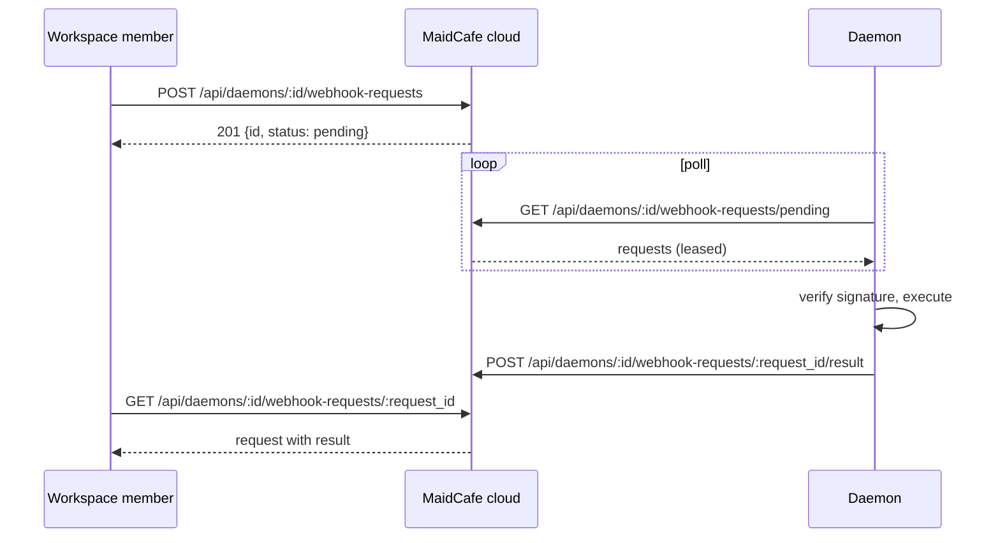

# MaidCafe Cloud API

HTTP API for the MaidCafe cloud control plane. The cloud registers daemons,
scopes them to Solar workspaces, stores their metrics and notifications, and
relays webhook invocations to them over polling.

## Conventions

- **Base URL**: the cloud service listens on `http.port` (default `8080`).
  All routes below are relative to that origin.
- **Authentication**:
  - User routes require `Authorization: Bearer <solar-token>` (a Solar
    Network session token validated against the auth service).
  - Daemon ingestion routes require `Authorization: Bearer <daemon-secret>`
    (the one-time secret returned at daemon registration).
  - The two credential classes are mutually exclusive: a daemon secret cannot
    call user routes and a Solar token cannot call daemon routes.
- **Content type**: request bodies are JSON, `Content-Type: application/json`.
  User-route bodies are limited to 1 MiB.
- **Timestamps**: all `*_at` fields are RFC 3339 strings in UTC.
- **Errors**: every error response is `{"error": "<message>"}`.

| Status | Meaning |
| --- | --- |
| `400` | Malformed JSON or invalid field values |
| `401` | Missing/invalid token or daemon secret |
| `403` | Authenticated but not a workspace member |
| `404` | Resource not found |
| `500` | Internal error |

## Workspace authorization

Every daemon belongs to exactly one workspace (`workspace_id`). User routes
that touch daemons or notifications verify, through the Solar workspace
service (`DyWorkspaceService.IsMemberWithRole`), that the authenticated
account is a member of that workspace with role level **Member (50)** or
higher. Non-members receive `403`; an unreachable workspace service is an
error, never a grant.

## Resources

### Daemon

```json
{
  "id": "d0f2f0c2-...",
  "workspace_id": "5f1c...",
  "name": "managed-host-01",
  "enabled": true,
  "last_seen_at": "2026-08-15T12:00:00Z",
  "created_at": "2026-08-15T10:00:00Z",
  "updated_at": "2026-08-15T12:00:00Z"
}
```

Daemon registration additionally returns the one-time `secret`:

```json
{
  "id": "d0f2f0c2-...",
  "workspace_id": "5f1c...",
  "name": "managed-host-01",
  "enabled": true,
  "last_seen_at": null,
  "created_at": "2026-08-15T10:00:00Z",
  "updated_at": "2026-08-15T10:00:00Z",
  "secret": "kVxR..."
}
```

The secret is returned only by `POST /api/daemons` and
`POST /api/daemons/:id/rotate-secret`. It is never included in list or read
responses.

### Metric

```json
{
  "id": "9a3b...",
  "daemon_id": "d0f2f0c2-...",
  "sent_at": "2026-08-15T12:00:00Z",
  "received_at": "2026-08-15T12:00:01Z",
  "uptime_seconds": 86400,
  "process_memory_bytes": 52428800,
  "cpu_percent": 12.5,
  "memory_used_percent": 41.2,
  "memory_used_bytes": 8430546944,
  "memory_total_bytes": 20462829568,
  "webhook_executions": 42,
  "webhook_failures": 1
}
```

### Alarm

```json
{
  "id": "77e1...",
  "daemon_id": "d0f2f0c2-...",
  "kind": "cpu_percent",
  "threshold": 80,
  "enabled": true,
  "cooldown_seconds": 300,
  "last_triggered_at": null,
  "created_at": "2026-08-15T10:00:00Z",
  "updated_at": "2026-08-15T10:00:00Z"
}
```

### Notification

```json
{
  "id": "c5d4...",
  "account_id": "acc-...",
  "workspace_id": "5f1c...",
  "daemon_id": "d0f2f0c2-...",
  "kind": "webhook.failure",
  "title": "Webhook backup failed",
  "body": "exit code 1",
  "metadata": {"name": "backup", "exit_code": 1},
  "read_at": null,
  "created_at": "2026-08-15T10:00:00Z"
}
```

### Webhook request (relay)

```json
{
  "id": "3f9a...",
  "name": "backup",
  "body": "eyJqb2IiOiJpbmNyZW1lbnRhbCJ9",
  "signature": "7f9a...",
  "status": "pending",
  "result_code": 0,
  "result_body": "",
  "result_error": "",
  "created_at": "2026-08-15T10:00:00Z",
  "updated_at": "2026-08-15T10:00:00Z"
}
```

`body` and `result_body` are base64-encoded. `status` is one of
`pending` (queued), `leased` (a daemon polled it), or `done` (result
stored). `result_*` fields are omitted until the request is `done`.

## Endpoints

### Public

#### `GET /health`

Unauthenticated liveness probe.

```sh
curl http://localhost:8080/health
```

`200`:

```json
{"ok": true, "mode": "cloud"}
```

`GET /` serves the HTML landing page.

### Daemons (user routes)

#### `POST /api/daemons`

Register a daemon in a workspace. The caller must be a member of
`workspace_id`.

```sh
curl -X POST http://localhost:8080/api/daemons \
  -H 'Authorization: Bearer <solar-token>' \
  -H 'Content-Type: application/json' \
  -d '{"workspace_id":"5f1c...","name":"managed-host-01"}'
```

`201` returns the full daemon plus the one-time `secret`; store the secret in
the managed host configuration (e.g. `daemon.cloudSecret`).

| Field | Type | Constraints |
| --- | --- | --- |
| `workspace_id` | string | required, non-empty |
| `name` | string | required, non-empty |

Errors: `403` if the account is not a member of the workspace.

#### `GET /api/daemons?workspace_id=`

List daemons in a workspace, newest first.

```sh
curl 'http://localhost:8080/api/daemons?workspace_id=5f1c...' \
  -H 'Authorization: Bearer <solar-token>'
```

`200` returns an array of daemons (no secrets).

| Query | Type | Notes |
| --- | --- | --- |
| `workspace_id` | string | required |

#### `GET /api/daemons/:id`

Read one daemon.

```sh
curl http://localhost:8080/api/daemons/d0f2f0c2-... \
  -H 'Authorization: Bearer <solar-token>'
```

`200` returns the daemon. `403` if the caller is not a member of its
workspace; `404` if unknown.

#### `PATCH /api/daemons/:id`

Change the name or enabled state.

```sh
curl -X PATCH http://localhost:8080/api/daemons/d0f2f0c2-... \
  -H 'Authorization: Bearer <solar-token>' \
  -H 'Content-Type: application/json' \
  -d '{"name":"managed-host-01","enabled":false}'
```

Both fields are optional; omitted fields are unchanged. `200` returns the
updated daemon.

#### `POST /api/daemons/:id/rotate-secret`

Invalidate the current daemon secret and issue a new one. The previous secret
stops working immediately.

```sh
curl -X POST http://localhost:8080/api/daemons/d0f2f0c2-.../rotate-secret \
  -H 'Authorization: Bearer <solar-token>'
```

`200`:

```json
{"secret": "kVxR..."}
```

#### `DELETE /api/daemons/:id`

Soft-delete: disables the daemon (further ingestion returns `401`) and keeps
the row as an audit record. Metric history is retained.

```sh
curl -X DELETE http://localhost:8080/api/daemons/d0f2f0c2-... \
  -H 'Authorization: Bearer <solar-token>'
```

`204` on success.

#### `GET /api/daemons/:id/metrics`

List metric history, newest first.

```sh
curl 'http://localhost:8080/api/daemons/d0f2f0c2-.../metrics?limit=50&before=2026-08-15T11:00:00Z' \
  -H 'Authorization: Bearer <solar-token>'
```

`200` returns an array of metrics.

| Query | Type | Default | Bounds |
| --- | --- | --- | --- |
| `limit` | int | `100` | `1..100` |
| `before` | RFC 3339 | — | exclusive cursor on `sent_at` |

#### `GET /api/daemons/:id/alarms`

List the daemon's alarms, oldest first.

```sh
curl http://localhost:8080/api/daemons/d0f2f0c2-.../alarms \
  -H 'Authorization: Bearer <solar-token>'
```

`200` returns an array of alarms.

#### `PUT /api/daemons/:id/alarms`

Create or update the alarm for a metric kind (one alarm per kind).

```sh
curl -X PUT http://localhost:8080/api/daemons/d0f2f0c2-.../alarms \
  -H 'Authorization: Bearer <solar-token>' \
  -H 'Content-Type: application/json' \
  -d '{"kind":"cpu_percent","threshold":80,"enabled":true,"cooldown_seconds":300}'
```

`200` returns the alarm.

| Field | Type | Constraints |
| --- | --- | --- |
| `kind` | string | `cpu_percent` or `memory_used_percent` |
| `threshold` | number | `0 < x <= 100` |
| `enabled` | bool | required |
| `cooldown_seconds` | int | default `300`; must be positive |

When an ingested metric crosses the threshold, the cloud creates a
notification of kind `daemon.alarm.<kind>` for the daemon's workspace.

#### `DELETE /api/daemons/:id/alarms/:alarm_id`

Remove an alarm. `204` on success; `404` if the alarm does not belong to the
daemon.

```sh
curl -X DELETE http://localhost:8080/api/daemons/d0f2f0c2-.../alarms/77e1... \
  -H 'Authorization: Bearer <solar-token>'
```

#### `POST /api/daemons/:id/push-notification`

Push a notification into the daemon's workspace (e.g. manual maintenance
announcements). `202` returns the created notification.

```sh
curl -X POST http://localhost:8080/api/daemons/d0f2f0c2-.../push-notification \
  -H 'Authorization: Bearer <solar-token>' \
  -H 'Content-Type: application/json' \
  -d '{"kind":"maintenance","title":"Restart","body":"Restart after backup"}'
```

| Field | Type | Constraints |
| --- | --- | --- |
| `kind` | string | required, `<= 128` bytes |
| `title` | string | required, `<= 128` bytes |
| `body` | string | required, `<= 4096` bytes |
| `metadata` | object | optional, `<= 16 KiB` serialized |

### Notifications (user routes)

#### `GET /api/notifications?workspace_id=`

List notifications in a workspace, newest first.

```sh
curl 'http://localhost:8080/api/notifications?workspace_id=5f1c...&unread=true' \
  -H 'Authorization: Bearer <solar-token>'
```

`200` returns an array of notifications.

| Query | Type | Default | Bounds |
| --- | --- | --- | --- |
| `workspace_id` | string | — | required |
| `unread` | bool | `false` | only `read_at IS NULL` rows |
| `daemon_id` | string | — | narrow to one daemon |
| `limit` | int | `50` | `1..100` |
| `before` | RFC 3339 | — | exclusive cursor on `created_at` |

#### `POST /api/notifications/:id/read`

Mark a notification read (idempotent). `204` on success; `403` if the caller
is not a member of the notification's workspace.

```sh
curl -X POST http://localhost:8080/api/notifications/c5d4.../read \
  -H 'Authorization: Bearer <solar-token>'
```

**Realtime fan-out**: when `eventbus.url` is configured, every created
notification is additionally published to NATS JetStream (stream
`maidcafe_events`, subject `maidcafe.notification.v1`) with the same fields as
the notification resource plus `event_id` and `timestamp`. Consumers can
subscribe there instead of polling this endpoint. When
`eventbus.subjectPrefix` is set (e.g. `staging`), the subject becomes
`<prefix>.maidcafe.notification.v1` so multiple deployments can share one NATS
server without collisions.

### Webhook relay (user routes)

The relay lets a workspace member invoke a named webhook on a managed host
through the cloud. The daemon polls for pending requests, verifies the
signature against its local configuration, executes the webhook, and reports
the result back.



#### `POST /api/daemons/:id/webhook-requests`

Enqueue a signed webhook invocation.

```sh
curl -X POST http://localhost:8080/api/daemons/d0f2f0c2-.../webhook-requests \
  -H 'Authorization: Bearer <solar-token>' \
  -H 'Content-Type: application/json' \
  -d '{"name":"backup","body":"eyJqb2IiOiJpbmNyZW1lbnRhbCJ9","signature":"7f9a..."}'
```

`201`:

```json
{"id": "3f9a...", "status": "pending", "created_at": "2026-08-15T10:00:00Z"}
```

| Field | Type | Constraints |
| --- | --- | --- |
| `name` | string | required; must match a webhook configured on the daemon |
| `body` | string | required base64, `<= 256 KiB` decoded |
| `signature` | string | required; HMAC over the raw body |

#### `GET /api/daemons/:id/webhook-requests/:request_id`

Read a relayed request and, once the daemon completed it, its result.

`200` returns a webhook request resource. `404` if unknown.

### Daemon ingestion routes

These routes use `Authorization: Bearer <daemon-secret>`. They are how the
managed host reports into its cloud record; the secret never changes except
through rotation.

#### `POST /api/daemons/:id/metrics`

Ingest a metric sample. `204` on success; `401` on a bad/disabled daemon
secret; `400` on an invalid sample.

```sh
curl -X POST http://localhost:8080/api/daemons/d0f2f0c2-.../metrics \
  -H 'Authorization: Bearer <daemon-secret>' \
  -H 'Content-Type: application/json' \
  -d '{
    "sent_at": "2026-08-15T12:00:00Z",
    "uptime_seconds": 86400,
    "process_memory_bytes": 52428800,
    "cpu_percent": 12.5,
    "memory_used_percent": 41.2,
    "memory_used_bytes": 8430546944,
    "memory_total_bytes": 20462829568,
    "webhook_executions": 42,
    "webhook_failures": 1
  }'
```

| Field | Constraints |
| --- | --- |
| `sent_at` | required, non-zero |
| `uptime_seconds` | `>= 0` |
| `process_memory_bytes` | `>= 0` |
| `cpu_percent` | `0..100` |
| `memory_used_percent` | `0..100` |

Ingestion also records `last_seen_at` on the daemon and evaluates enabled
alarms.

#### `POST /api/daemons/:id/notifications`

Create a notification from the daemon (e.g. webhook success/failure). `201`
returns `{"id": "...", "created_at": "..."}`.

```sh
curl -X POST http://localhost:8080/api/daemons/d0f2f0c2-.../notifications \
  -H 'Authorization: Bearer <daemon-secret>' \
  -H 'Content-Type: application/json' \
  -d '{"kind":"webhook.failure","title":"Webhook backup failed","body":"exit code 1"}'
```

Same field constraints as `POST /api/daemons/:id/push-notification`. The
notification is stored under the daemon's workspace.

#### `GET /api/daemons/:id/webhook-requests/pending?limit=`

Poll for pending webhook invocations. The daemon should poll on a short
interval. Returned requests are leased: they are not handed out again, and a
lease expires after 2 minutes (a daemon that died mid-execution loses the
lease and the request is reclaimed).

```sh
curl 'http://localhost:8080/api/daemons/d0f2f0c2-.../webhook-requests/pending' \
  -H 'Authorization: Bearer <daemon-secret>'
```

`200`:

```json
{"requests": [{"id": "3f9a...", "name": "backup", "body": "eyJqb2IiOiJpbmNyZW1lbnRhbCJ9", "signature": "7f9a...", "status": "leased", "created_at": "..."}]}
```

| Query | Type | Default | Bounds |
| --- | --- | --- | --- |
| `limit` | int | `50` | `1..50` |

#### `POST /api/daemons/:id/webhook-requests/:request_id/result`

Report the execution result for a leased request. `204` on success; `404` if
the request is not leased to this daemon (e.g. the lease expired).

```sh
curl -X POST http://localhost:8080/api/daemons/d0f2f0c2-.../webhook-requests/3f9a.../result \
  -H 'Authorization: Bearer <daemon-secret>' \
  -H 'Content-Type: application/json' \
  -d '{"code":200,"body":"b2s=","error":""}'
```

| Field | Type | Constraints |
| --- | --- | --- |
| `code` | int | webhook exit/HTTP code |
| `body` | string | base64 result body |
| `error` | string | `<= 512` bytes |

## End-to-end daemon flow

1. A workspace member registers the host: `POST /api/daemons` with
   `workspace_id` and a name. The response's `secret` is written to the host's
   daemon configuration (`daemon.cloudUrl` + `daemon.cloudSecret`).
2. The daemon polls `GET /api/daemons/:id/webhook-requests/pending`, executes
   leased requests locally, and reports results.
3. The daemon pushes metrics on its interval and notifications on webhook
   success/failure; the cloud stamps `received_at` and `last_seen_at`.
4. Workspace members list daemons, metrics, alarms, and notifications, and
   invoke webhooks through the relay. Everything is scoped to the workspace
   the daemon belongs to.
